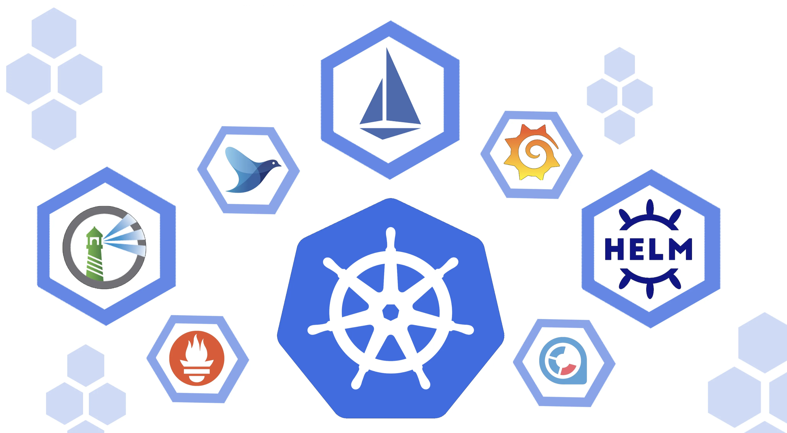

# Learn Kubernetes the kind way	

[TOC]

Local [Kubernete](https://kubernetes.io/) exercise for documenting and playing with [Helm](https://helm.sh/) locally.

The purpose of this repo is to share some fantastic tools for playing with Kubernetes and Helm. I feel as a full stack developer that I don't get an excuse to play with this enough, to understand it like a devops engineer does. Recently that all changed as I had a reason to do this for setting up a local development project with lots  of scaled out microservices using scaling or *replicas*. My local environment was a docker setup and it only scaled to one solitary instance and possibly a manual second outside of docker. 

So I discussed this with my lovely colleague, *Aditya Gundecha*, and he shared some lovely tools with all of us that I feel are a must have for any team wanting to get their hands dirty with Kubernetes locally. So this is a dedication to *Aditya*, who shared with me and now I want to pass on this with others in the open source spirit of learning.

I have a Mac, but and I am 99% sure everything works on other platforms, follow the links

## Tools



1. [kind](https://sigs.k8s.io/kind) is a tool for running local Kubernetes clusters using Docker container “nodes”.
   kind was primarily designed for testing Kubernetes itself, but may be used for local development or CI.

   ```bash
   ❯ brew install kind
   ```

2. If you have [go](https://golang.org/) 1.16+ and [docker](https://www.docker.com/), [podman](https://podman.io/) or [nerdctl](https://github.com/containerd/nerdctl) installer. I used docker for this.

3. Install [helm](https://helm.sh/) and learn lots from this site

   ```bash
   ❯ brew install helm
   ```

4. Learn about [Argo-cd](https://argo-cd.readthedocs.io/en/stable/getting_started/) for Kubernetes and git repositories and become a legend.

## Exercises

### Setup kind to run nginx

The purpose of this exercise is to learn how to setup and use **kind** to generate a local kubernete stack. For more information see more [here](learn-kind.md).

### Setup Helm and helloworld on Argocd

The purpose of this is to learn and use helm with a deployment tool to understand how helm works and how you can deploy an app to this space. For more information read [here]().

### Setup a mock digital commerce platform

TODO
