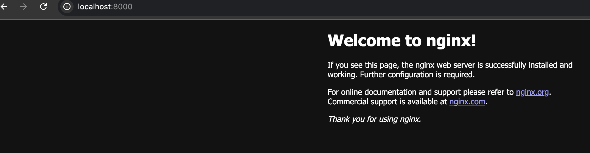
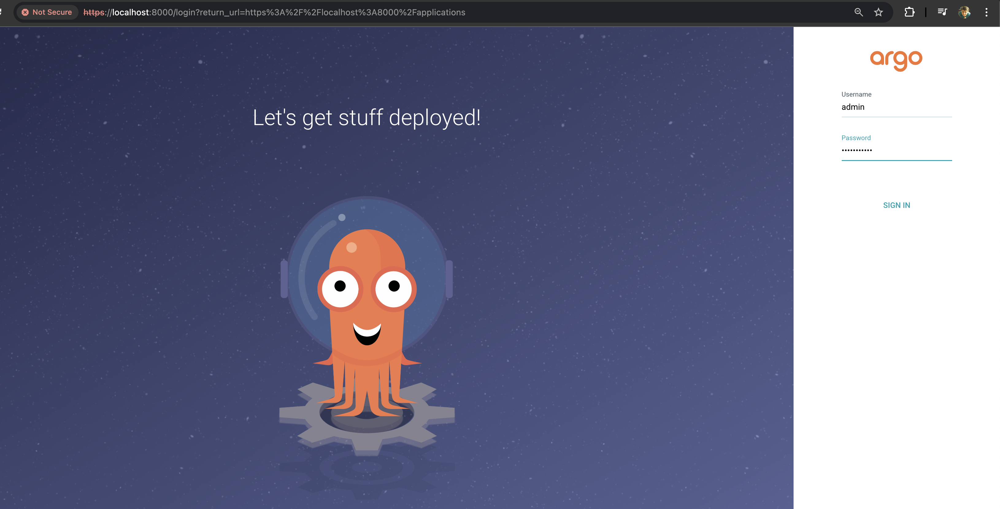
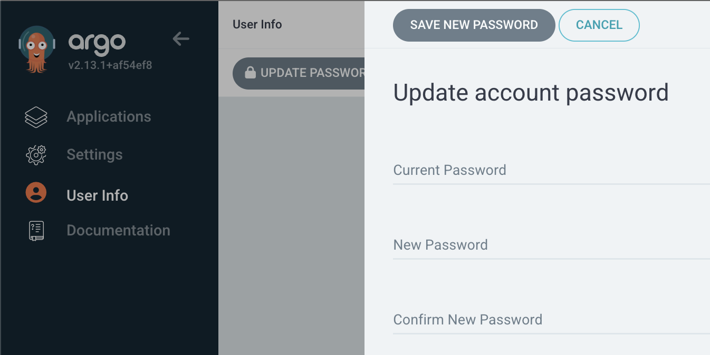
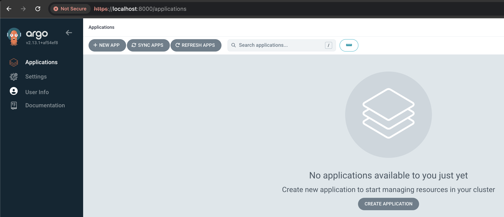
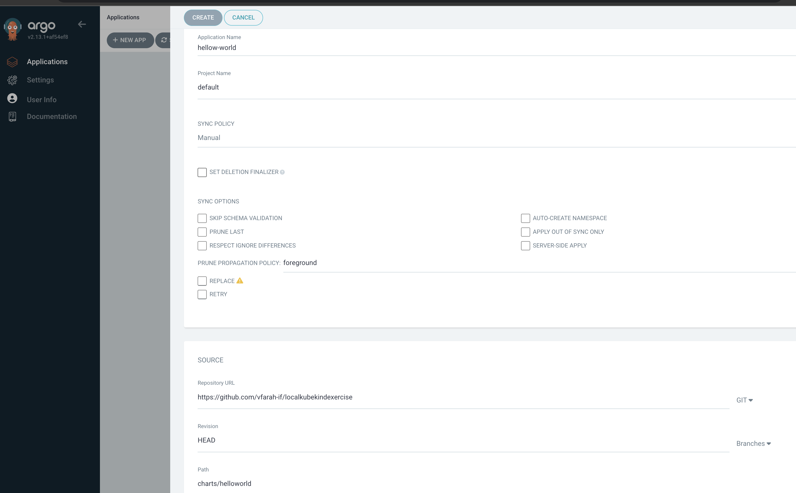
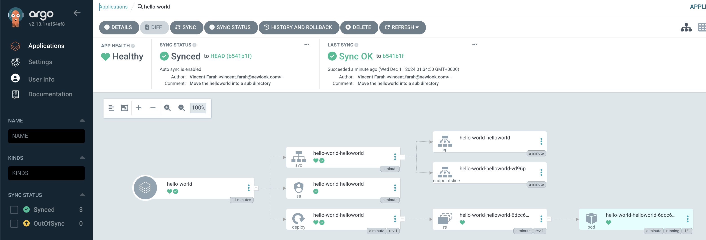
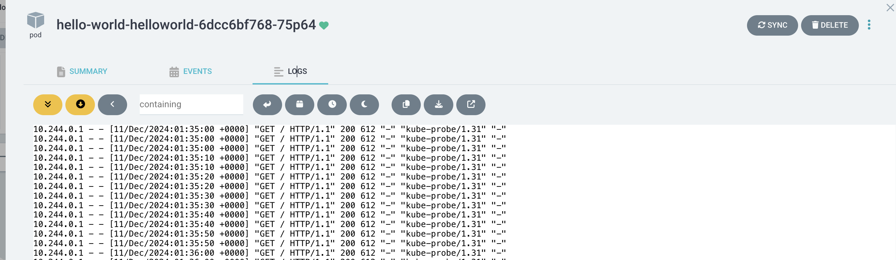

# localkubekindexercise

[TOC]

Local [Kubernete](https://kubernetes.io/) exercise for documenting and playing with [Helm](https://helm.sh/) locally.

The purpose of this repo is to share some fantastic tools for playing with Kubernetes and Helm. I feel as a full stack developer that I don't get an excuse to play with this enough, to understand it like a devops engineer does. Recently that all changed as I had a reason to do this for setting up a local development project with lots  of scaled out microservices using scaling or *replicas*. My local environment was a docker setup and it only scaled to one solitary instance and possibly a manual second outside of docker. 

So I discussed this with my lovely colleague, *Aditya Gundecha*, and he shared some lovely tools with all of us that I feel are a must have for any team wanting to get their hands dirty with Kubernetes locally. So this is a dedication to *Aditya*, who shared with me and now I want to pass on this with others in the open source spirit of learning.

I have a Mac, but and I am 99% sure everything works on other platforms, follow the links

## Tools


1. [kind](https://sigs.k8s.io/kind) is a tool for running local Kubernetes clusters using Docker container “nodes”.
   kind was primarily designed for testing Kubernetes itself, but may be used for local development or CI.

   ```bash
   ❯ brew install kind
   ```

2. If you have [go](https://golang.org/) 1.16+ and [docker](https://www.docker.com/), [podman](https://podman.io/) or [nerdctl](https://github.com/containerd/nerdctl) installer. I used docker for this.

3. Install [helm](https://helm.sh/) and learn lots from this site

   ```bash
   ❯ brew install helm
   ```

4. Learn about [Argo-cd](https://argo-cd.readthedocs.io/en/stable/getting_started/) for Kubernetes and git repositories and become a legend.

## Exercises

### Setup kind to run nginx

1. Set **kubectl** context to "kind-kind" `kubectl cluster-info --context kind-kind`

2. Check information about this

   ```bash
   ❯ kubectl cluster-info --context kind-kind
   Kubernetes control plane is running at https://127.0.0.1:49369
   CoreDNS is running at https://127.0.0.1:49369/api/v1/namespaces/kube-system/services/kube-dns:dns/proxy
   ```

3. Above I installed docker so here is a query on docker for seeing this

   ```bash
   ❯  docker exec -it kind-control-plane crictl images
   registry.k8s.io/etcd                            3.5.15-0             27e3830e14027       66.5MB
   registry.k8s.io/kube-apiserver-arm64            v1.31.2              7db5e8fdce19a       92.6MB
   registry.k8s.io/kube-apiserver                  v1.31.2              7db5e8fdce19a       92.6MB
   registry.k8s.io/kube-controller-manager-arm64   v1.31.2              d034a1438c8ae       87MB
   registry.k8s.io/kube-controller-manager         v1.31.2              d034a1438c8ae       87MB
   registry.k8s.io/kube-proxy-arm64                v1.31.2              7e641dea6ec8f       96MB
   registry.k8s.io/kube-proxy                      v1.31.2              7e641dea6ec8f       96MB
   registry.k8s.io/kube-scheduler-arm64            v1.31.2              4ff74b8997ace       67MB
   registry.k8s.io/kube-scheduler                  v1.31.2              4ff74b8997ace       67MB
   registry.k8s.io/pause                           3.10                 afb61768ce381       268kB
   ```

4. In the repository is a [deployment.yaml](./deployment.yaml) file to deploy an nginx load balancer

   ```bash
   ❯ kubectl apply -f deployment.yaml
   deployment.apps/nginx-deployment created
   ```

5. **Check** if it is up and running

   ```bash
   ❯ kubectl get pods
   NAME                                READY   STATUS    RESTARTS   AGE
   nginx-deployment-54b9c68f67-h4sxh   1/1     Running   0          83s
   nginx-deployment-54b9c68f67-p6jdv   1/1     Running   0          83s
   nginx-deployment-54b9c68f67-t28t6   1/1     Running   0          83s
   ```

6. Set this up with **port forwarding** ...

   ```bash
   ❯ kubectl port-forward nginx-deployment-54b9c68f67-h4sxh 8000:80
   Forwarding from 127.0.0.1:8000 -> 80
   Forwarding from [::1]:8000 -> 80
   ```

7. **Browse** to this and remember as soon as you close that session, port forwading will dissapear

   

8. **Query** the pods

   ```bash
   ❯ kubectl get pods
   NAME                                READY   STATUS    RESTARTS   AGE
   nginx-deployment-54b9c68f67-h4sxh   1/1     Running   0          83s
   nginx-deployment-54b9c68f67-p6jdv   1/1     Running   0          83s
   nginx-deployment-54b9c68f67-t28t6   1/1     Running   0          83s
   ```

9. **Scale up** replicas to 5 and redeploy within the local **deployment.yaml** file changing `replicas: 3` to `replicas: 5` 

   ```
   ❯ kubectl apply -f deployment.yaml
   	deployment.apps/nginx-deployment configured
   
   ❯ kubectl get pods
   	NAME                                READY   STATUS    RESTARTS   AGE
   	nginx-deployment-54b9c68f67-7lfn8   1/1     Running   0          6s
   	nginx-deployment-54b9c68f67-h4sxh   1/1     Running   0          46h
   	nginx-deployment-54b9c68f67-p6jdv   1/1     Running   0          46h
   	nginx-deployment-54b9c68f67-rlvw4   1/1     Running   0          6s
   	nginx-deployment-54b9c68f67-t28t6   1/1     Running   0          46h
   
   ```

10. **Delete** this and cleanup 

    ```bash
    ❯ kubectl delete -f deployment.yaml
    deployment.apps "nginx-deployment" deleted
    ```

11. **Check** there are no pods

    ```bash
    ❯ kubectl get pods
    No resources found in default namespace.
    ```

### Setup Helm and helloworld on argo cd

1. Ensure **Helm** is installed on your local machine or the system where you are managing all of this. The only reason is the end result will be using trhe CLI to create scripts to bash/powershell all kinds of things into your local kubernete. Use chocolate on windows.

   ```bash
   ❯ brew install helm
   ```

2. Once Helm is **installed**, you can deploy applications using [Helm charts](https://kubernetes.github.io/ingress-nginx/deploy/).

   ```bash
   ❯ helm repo add ingress-nginx https://kubernetes.github.io/ingress-nginx
   ❯ helm install nginx-ingress ingress-nginx/ingress-nginx
   ```

3. **Verify Installation** 

   ```bash
   ❯ helm list --all-namespaces
   ❯ kubectl get pods -A
   ```

4. Create **helloworld** or see in the code base it already created

   ```bash
   ❯ helm create helloworld
   Creating helloworld
   
   helloworld
   ├── Chart.yaml       # Metadata about the Helm chart
   ├── values.yaml      # Default configuration values
   ├── templates/       # Kubernetes manifests templates
    │   ├── deployment.yaml
    │   ├── service.yaml
    │   ├── ingress.yaml
    │   ├── _helpers.tpl
    │   ├── hpa.yaml
    │   └── tests/
    │       └── test-connection.yaml
   ├── charts/          # Directory for chart dependencies
   └── README.md        # Chart documentation
   ```

5. Create a namespace for Argocd ready to install into, a namespace being a logic area in your cluster

   ```bash
   ❯ kubectl create namespace argocd
   ```

6. Setup **Argocd** on your local if you haven't already, to deploy hello world into it. Push what I generated into a repository or branch under your own name and deploy it.

   ```bash
   ❯ kubectl apply -n argocd -f https://raw.githubusercontent.com/argoproj/argo-cd/stable/manifests/install.yaml
   
   customresourcedefinition.apiextensions.k8s.io/applications.argoproj.io created
   customresourcedefinition.apiextensions.k8s.io/applicationsets.argoproj.io created
   ...
   networkpolicy.networking.k8s.io/argocd-server-network-policy created
   ```

7. Check if argo exists 

   ````bash
   ❯ kubectl get svc -n argocd
   
   NAME                                      TYPE           CLUSTER-IP      EXTERNAL-IP   PORT(S)                      AGE
   argocd-applicationset-controller          ClusterIP      10.96.151.231   <none>        7000/TCP,8080/TCP            38h
   argocd-dex-server                         ClusterIP      10.96.113.190   <none>        5556/TCP,5557/TCP,5558/TCP   38h
   argocd-metrics                            ClusterIP      10.96.137.8     <none>        8082/TCP                     38h
   argocd-notifications-controller-metrics   ClusterIP      10.96.206.94    <none>        9001/TCP                     38h
   argocd-redis                              ClusterIP      10.96.80.248    <none>        6379/TCP                     38h
   argocd-repo-server                        ClusterIP      10.96.67.80     <none>        8081/TCP,8084/TCP            38h
   argocd-server                             LoadBalancer   10.96.214.213   <pending>     80:31270/TCP,443:31039/TCP   38h
   argocd-server-metrics                     ClusterIP      10.96.243.65    <none>        8083/TCP 
   ````

8. List all the namespaces

   ```bash
   ❯ kubectl get namespace
   NAME                 STATUS   AGE
   argocd               Active   152m
   default              Active   2d19h
   kube-node-lease      Active   2d19h
   kube-public          Active   2d19h
   kube-system          Active   2d19h
   local-path-storage   Active   2d19h
   ```

9. Check the pods in the argo cd namespace

   ```bash
   ❯ kubectl get pods -n argocd
   
   NAME                                                READY   STATUS    RESTARTS      AGE
   argocd-application-controller-0                     1/1     Running   2 (33h ago)   38h
   argocd-applicationset-controller-7ff94fc879-ql5nq   1/1     Running   2 (33h ago)   38h
   argocd-dex-server-84b879d87c-8grq8                  1/1     Running   2 (33h ago)   38h
   argocd-notifications-controller-6c65b4b9f6-xlc76    1/1     Running   2 (33h ago)   38h
   argocd-redis-868dbb7cf4-tq5pf                       1/1     Running   2 (33h ago)   38h
   argocd-repo-server-6d47848766-d5nw6                 1/1     Running   2 (33h ago)   38h
   argocd-server-c9f58d8cf-b52dk                       1/1     Running   4 (33h ago)   38h
   ```

10. Show all the services in the argo cd namespace inorder to do portforwarding for **argocd-server** 

    ```bash
    ❯ kubectl get svc -n argocd
    
    NAME                                      TYPE           CLUSTER-IP      EXTERNAL-IP   PORT(S)                      AGE
    argocd-applicationset-controller          ClusterIP      10.96.151.231   <none>        7000/TCP,8080/TCP            38h
    argocd-dex-server                         ClusterIP      10.96.113.190   <none>        5556/TCP,5557/TCP,5558/TCP   38h
    argocd-metrics                            ClusterIP      10.96.137.8     <none>        8082/TCP                     38h
    argocd-notifications-controller-metrics   ClusterIP      10.96.206.94    <none>        9001/TCP                     38h
    argocd-redis                              ClusterIP      10.96.80.248    <none>        6379/TCP                     38h
    argocd-repo-server                        ClusterIP      10.96.67.80     <none>        8081/TCP,8084/TCP            38h
    argocd-server                             LoadBalancer   10.96.214.213   <pending>     80:31270/TCP,443:31039/TCP   38h
    argocd-server-metrics                     ClusterIP      10.96.243.65    <none>        8083/TCP    
    ```

11. Now do the port forwarding

    ```bash
    ❯ kubectl port-forward -n argocd service/argocd-server 8000:80 &
    
    Forwarding from 127.0.0.1:8000 -> 8080                               at 00:35:55
    Forwarding from [::1]:8000 -> 8080
    ```

12. Get the argo CD secret 

    ```bash
    ❯ kubectl get secrets argocd-initial-admin-secret -o yaml -n argocd
    
    apiVersion: v1
    data:
      password: ZEZ4TU5heVQ0TjJ3LXpOcA==
    kind: Secret
    metadata:
      creationTimestamp: "2024-12-09T09:27:57Z"
      name: argocd-initial-admin-secret
      namespace: argocd
      resourceVersion: "212665"
      uid: 4c2e877a-b25b-4248-8505-b32311ca896b
    type: Opaque
    ```

13. Base decode the value

    ```bash
    ❯ echo -n 'ZEZ4TU5heVQ0TjJ3LXpOcA==' | base64 -d
    
    dFxMNayT4N2w-zNp
    ```

14. Login to the system using this password on https://localhost:8000/applications using `admin` and password `dFxMNayT4N2w-zNp`

    

15. Change the password manually the first time to something you won't forget but we will get into how we can automate this using bash for the next exercise

    

16. And now you are ready to apply this repo to your local copy of argo cd.

    

17. Configure application

    

18. Add the application using my git repository https://github.com/vfarah-if/localkubekindexercise

    

19. And drilling into the logs

    

20. Check for hello world service by name which **hello-world-helloworld**

    ```bash
    ❯ kubectl get svc -n default
    
    NAME                     TYPE        CLUSTER-IP      EXTERNAL-IP   PORT(S)   AGE
    hello-world-helloworld   ClusterIP   10.96.232.221   <none>        80/TCP    14m
    kubernetes               ClusterIP   10.96.0.1       <none>        443/TCP   4d9h
    ```

21. Do some **port forwarding** to get to hello world onto port 8001 locally

    ```bash
    ❯ kubectl port-forward -n default service/hello-world-helloworld 8001:80 &
    [1] 85508
    ~/Dev/localkubekindexercise on main !2 ?3 ❯ Forwarding from 127.0.0.1:8001 -> 80         at 01:50:53
    Forwarding from [::1]:8001 -> 80
    ```

    
