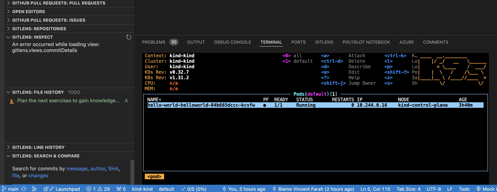

# Learn Kubernetes the kind way	

[TOC]

Local [Kubernete](https://kubernetes.io/) exercise for documenting and playing with [Helm](https://helm.sh/) locally.

The purpose of this repo is to share some fantastic tools for playing with Kubernetes and Helm. I feel as a full stack developer that I don't get an excuse to play with this enough, to understand it like a devops engineer does. Recently that all changed as I had a reason to do this for setting up a local development project with lots  of scaled out microservices using scaling or *replicas*. My local environment was a docker setup and it only scaled to one solitary instance and possibly a manual second outside of docker. 

So I discussed this with my lovely colleague, *Aditya Gundecha*, and he shared some lovely tools with all of us that I feel are a must have for any team wanting to get their hands dirty with Kubernetes locally, and other *devopsy* things. So this is a dedication to *Aditya*, who shared with me and now I want to pass on this with others in the open source spirit of learning.

I have a Mac, but I am 99% sure everything works on other platforms, follow the links ...

## Tools


1. [kind](https://sigs.k8s.io/kind) is a tool for running local Kubernetes clusters using Docker container “nodes”.
   kind was primarily designed for testing Kubernetes itself, but may be used for local development or CI.

   ```bash
   ❯ brew install kind
   ```

2. If you have [go](https://golang.org/) 1.16+ and [docker](https://www.docker.com/), [podman](https://podman.io/) or [nerdctl](https://github.com/containerd/nerdctl) installer. I used docker for this.

3. Install [helm](https://helm.sh/) and learn lots from this site

   ```bash
   ❯ brew install helm
   ```

4. Learn about [Argo-cd](https://argo-cd.readthedocs.io/en/stable/getting_started/) for Kubernetes and git repositories and become a legend.

5. [Dotfiles](https://dotfiles.github.io/) is a devops helper site for programs that help with managing, syncing, and/or installing your dotfiles which ***Backup\***, ***restore\***, and ***sync\*** the prefs and settings for your toolbox. 

6. [K9s](https://k9scli.io/) is a terminal based UI to interact with your Kubernetes clusters. The aim of this project is to make it easier to navigate, observe and manage your deployed applications in the wild. K9s continually watches Kubernetes for changes and offers subsequent commands to interact with your observed resources.

   ```bash
   ❯ brew install derailed/k9s/k9s
   ```

   

7. [Backstage](https://backstage.io/demos/) is an open source framework for building developer portals from *Spotify*.

8. https://github.com/jesseduffield/lazygit speaks for itself.

9. [tmux](https://github.com/tmux/tmux/wiki) is a terminal multiplexer. It lets you switch easily between several programs in one terminal, detach them (they keep running in the background) and reattach them to a different terminal.  

## Exercises

### 1. Setup kind to run nginx

The purpose of this exercise is to learn how to setup and use **kind** to generate a local kubernete stack. For more information see more [here](learn-kind.md).

### 2. Setup a Mongo on kind

The purpose of this is to setup [Mongo](https://www.mongodb.com/blog/post/top-4-reasons-to-use-mongodb-8-0?tck=mdb80_blog_pencil_banner) and [Mongo Express](https://www.mongodb.com/resources/products/compatibilities/express) on here for database usage going forward, to get it wrong and to debug how to get it right ... using everything learnt in the first exercise. For more information see more [here](learn-mongo.md).

### 3. Setup Helm and helloworld on Argocd

The purpose of this is to learn and use helm with a deployment tool to understand how helm works and how you can deploy an app to this space. For more information read [here](helm-argocd-helloworld.md).

### 4. Setup a mock digital commerce platform

The purpose of this is to be able to link up with an existing docker image and get it deployed to Argo. So this assumes you have setup the previous exercise, ready to use Helm and Argo. For more information read here.

- Create **fabric, inventory and search** using helm as placeholders to get deployed to argo

```bash
❯ helm create Fabric

Creating Fabric

❯ helm create Inventory

Creating Inventory

❯ helm create Search

Creating Search
```

## References

Here’s a comprehensive list of high-quality references and resources for learning **Helm**, **Kubernetes**, and **Docker** across various mediums like books, official documentation, tutorials, and videos:

------

## **Helm**

### **Official Documentation**

1. Helm Documentation
   - Comprehensive, up-to-date official documentation to understand Helm concepts, commands, and best practices.

### **Books**

1. *"Managing Kubernetes with Helm"* by Matt Butcher et al.
   - A detailed guide to managing applications in Kubernetes using Helm.
2. *"Helm Patterns"* by Matt Farina and Josh Dolitsky
   - Focuses on advanced patterns and techniques in Helm.

### **Online Courses**

1. [Helm for Kubernetes: Package Manager for Kubernetes](https://www.udemy.com/course/helm-for-kubernetes/) (Udemy)
   - Practical course on using Helm effectively with Kubernetes clusters.
2. [Kubernetes Package Management with Helm](https://www.pluralsight.com/courses/kubernetes-package-management-helm) (Pluralsight)
   - Covers the Helm ecosystem and its integration with Kubernetes.

### **Free Tutorials**

1. [Learn Helm Basics](https://helm.sh/docs/intro/using_helm/)
   - Step-by-step tutorial from the official Helm website.
2. [Katacoda - Helm Interactive Tutorials](https://www.katacoda.com/helm)
   - Interactive learning platform for practicing Helm commands.

------

## **Kubernetes**

### **Official Documentation**

1. [Kubernetes Docs](https://kubernetes.io/docs/)
   - Official, detailed documentation for all Kubernetes features and APIs.
2. [Kubernetes Concepts](https://kubernetes.io/docs/concepts/)
   - Best for learning the architecture, objects, and principles behind Kubernetes.

### **Books**

1. *"Kubernetes Up & Running"* by Kelsey Hightower, Brendan Burns, Joe Beda
   - A must-read for practical Kubernetes implementation.
2. *"The Kubernetes Book"* by Nigel Poulton
   - Excellent for beginners with clear explanations of Kubernetes concepts.

### **Online Courses**

1. [Kubernetes for Absolute Beginners - Hands-on](https://www.udemy.com/course/learn-kubernetes/) (Udemy)
   - Beginner-friendly course to get hands-on experience.
2. [Certified Kubernetes Administrator (CKA) Course](https://www.cncf.io/certification/cka/)
   - Ideal for those seeking in-depth knowledge with certification.
3. [Kubernetes on Google Cloud](https://www.coursera.org/learn/google-kubernetes-engine) (Coursera)
   - Explores Kubernetes using Google Cloud’s GKE.

### **Free Tutorials**

1. [Play with Kubernetes](https://labs.play-with-k8s.com/)
   - Interactive environment for Kubernetes exploration.
2. [Kubernetes by Example](https://kubernetesbyexample.com/)
   - Real-world examples of Kubernetes use cases.
3. [Katacoda Kubernetes Scenarios](https://www.katacoda.com/courses/kubernetes)
   - Hands-on Kubernetes tutorials and scenarios.

------

## **Docker**

### **Official Documentation**

1. [Docker Docs](https://docs.docker.com/)
   - Complete reference for Docker installation, setup, and usage.
2. [Docker CLI Reference](https://docs.docker.com/engine/reference/commandline/docker/)
   - In-depth documentation of all Docker commands.

### **Books**

1. *"Docker Deep Dive"* by Nigel Poulton
   - A great resource for mastering Docker concepts and commands.
2. *"Docker in Practice"* by Ian Miell and Aidan Hobson Sayers
   - Provides advanced practical use cases for Docker.

### **Online Courses**

1. [Docker Mastery: With Kubernetes + Swarm](https://www.udemy.com/course/docker-mastery/) (Udemy)
   - Comprehensive course for learning Docker with Kubernetes.
2. [Introduction to Containers with Docker, Kubernetes & OpenShift](https://www.coursera.org/learn/containers-docker-kubernetes-openshift) (Coursera)
   - Beginner-friendly course by Red Hat.
3. [Docker for DevOps](https://www.udemy.com/course/docker-tutorial-for-devops/) (Udemy)
   - Focuses on Docker in the context of DevOps workflows.

### **Free Tutorials**

1. [Docker Labs](https://dockerlabs.collabnix.com/)
   - Open-source repository for Docker learning labs and guides.
2. [Play with Docker](https://labs.play-with-docker.com/)
   - Hands-on playground for Docker.
3. [Awesome Docker](https://github.com/veggiemonk/awesome-docker)
   - Curated list of resources, tutorials, and tools for Docker.

------

## **YouTube Channels & Playlists**

1. **TechWorld with Nana**
   - Covers Kubernetes, Helm, and Docker with practical examples.
   - [YouTube Channel](https://www.youtube.com/c/TechWorldwithNana)
2. **Nigel Poulton**
   - Author of Kubernetes and Docker books, offering concise and practical videos.
   - [YouTube Channel](https://www.youtube.com/c/nigelpoulton)
3. **FreeCodeCamp**
   - Full-length tutorials for Kubernetes and Docker.
   - Example: [Docker & Kubernetes Full Course](https://www.youtube.com/watch?v=bhBSlnQcqCQ)
4. **Kunal Kushwaha**
   - Simplified tutorials on Kubernetes and Docker for beginners.
   - [YouTube Channel](https://www.youtube.com/c/KunalKushwaha)

------

## **Community Resources**

1. [CNCF Slack](https://slack.cncf.io/)
   - Community of Kubernetes, Helm, and Docker enthusiasts.
2. [Kubernetes Subreddit](https://www.reddit.com/r/kubernetes/)
   - A discussion forum for Kubernetes-related topics.
3. [Docker Subreddit](https://www.reddit.com/r/docker/)
   - Community-driven troubleshooting and learning.
4. [Helm GitHub Discussions](https://github.com/helm/helm/discussions)
   - Official community hub for Helm questions and answers.

------

This list should keep you busy for a while! Let me know if you'd like help exploring any of these resources in detail. 😊
