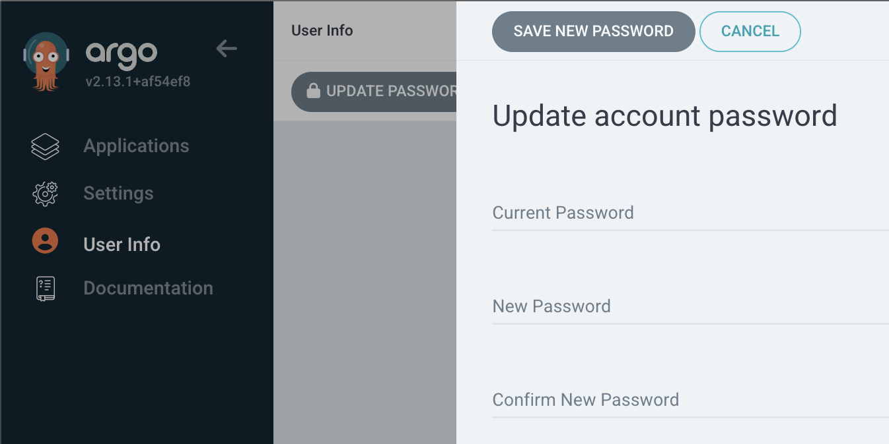
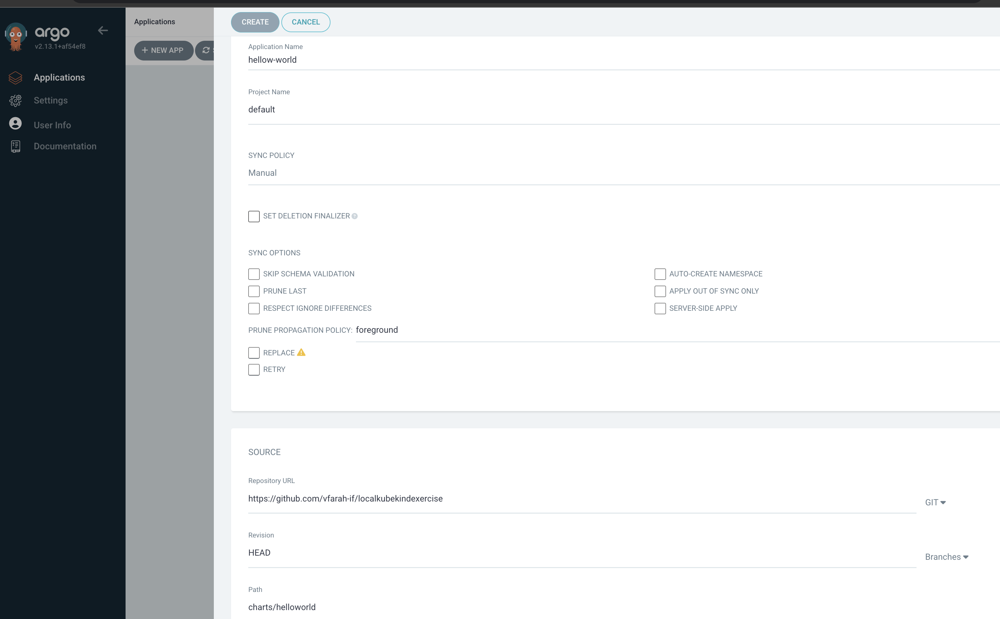

# Setup Helm and helloworld on Argocd

1. Ensure **Helm** is installed on your local machine or the system where you are managing all of this. The only reason is the end result will be using trhe CLI to create scripts to bash/powershell all kinds of things into your local kubernete. Use chocolate on windows.

   ```bash
   ❯ brew install helm
   ```

2. Once Helm is **installed**, you can deploy applications using [Helm charts](https://kubernetes.github.io/ingress-nginx/deploy/).

   ```bash
   ❯ helm repo add ingress-nginx https://kubernetes.github.io/ingress-nginx
   ❯ helm install nginx-ingress ingress-nginx/ingress-nginx
   ```

3. **Verify Installation** 

   ```bash
   ❯ helm list --all-namespaces
   ❯ kubectl get pods -A
   ```

4. Create **helloworld** or see in the code base it already created

   ```bash
   ❯ helm create helloworld
   Creating helloworld
   
   helloworld
   ├── Chart.yaml       # Metadata about the Helm chart
   ├── values.yaml      # Default configuration values
   ├── templates/       # Kubernetes manifests templates
    │   ├── deployment.yaml
    │   ├── service.yaml
    │   ├── ingress.yaml
    │   ├── _helpers.tpl
    │   ├── hpa.yaml
    │   └── tests/
    │       └── test-connection.yaml
   ├── charts/          # Directory for chart dependencies
   └── README.md        # Chart documentation
   ```

5. Create a namespace for Argocd ready to install into, a namespace being a logic area in your cluster

   ```bash
   ❯ kubectl create namespace argocd
   ```

6. Setup **Argocd** on your local if you haven't already, to deploy hello world into it. Push what I generated into a repository or branch under your own name and deploy it.

   ```bash
   ❯ kubectl apply -n argocd -f https://raw.githubusercontent.com/argoproj/argo-cd/stable/manifests/install.yaml
   
   customresourcedefinition.apiextensions.k8s.io/applications.argoproj.io created
   customresourcedefinition.apiextensions.k8s.io/applicationsets.argoproj.io created
   ...
   networkpolicy.networking.k8s.io/argocd-server-network-policy created
   ```

7. Check if Argo **exists** 

   ````bash
   ❯ kubectl get svc -n argocd
   
   NAME                                      TYPE           CLUSTER-IP      EXTERNAL-IP   PORT(S)                      AGE
   argocd-applicationset-controller          ClusterIP      10.96.151.231   <none>        7000/TCP,8080/TCP            38h
   argocd-dex-server                         ClusterIP      10.96.113.190   <none>        5556/TCP,5557/TCP,5558/TCP   38h
   argocd-metrics                            ClusterIP      10.96.137.8     <none>        8082/TCP                     38h
   argocd-notifications-controller-metrics   ClusterIP      10.96.206.94    <none>        9001/TCP                     38h
   argocd-redis                              ClusterIP      10.96.80.248    <none>        6379/TCP                     38h
   argocd-repo-server                        ClusterIP      10.96.67.80     <none>        8081/TCP,8084/TCP            38h
   argocd-server                             LoadBalancer   10.96.214.213   <pending>     80:31270/TCP,443:31039/TCP   38h
   argocd-server-metrics                     ClusterIP      10.96.243.65    <none>        8083/TCP 
   ````

8. List all the **namespaces**

   ```bash
   ❯ kubectl get namespace
   
   NAME                 STATUS   AGE
   argocd               Active   152m
   default              Active   2d19h
   kube-node-lease      Active   2d19h
   kube-public          Active   2d19h
   kube-system          Active   2d19h
   local-path-storage   Active   2d19h
   ```

9. Check the pods in the **argocd namespace**

   ```bash
   ❯ kubectl get pods -n argocd
   
   NAME                                                READY   STATUS    RESTARTS      AGE
   argocd-application-controller-0                     1/1     Running   2 (33h ago)   38h
   argocd-applicationset-controller-7ff94fc879-ql5nq   1/1     Running   2 (33h ago)   38h
   argocd-dex-server-84b879d87c-8grq8                  1/1     Running   2 (33h ago)   38h
   argocd-notifications-controller-6c65b4b9f6-xlc76    1/1     Running   2 (33h ago)   38h
   argocd-redis-868dbb7cf4-tq5pf                       1/1     Running   2 (33h ago)   38h
   argocd-repo-server-6d47848766-d5nw6                 1/1     Running   2 (33h ago)   38h
   argocd-server-c9f58d8cf-b52dk                       1/1     Running   4 (33h ago)   38h
   ```

10. Show all the services in the argo cd namespace inorder to do portforwarding for **argocd-server** 

    ```bash
    ❯ kubectl get svc -n argocd
    
    NAME                                      TYPE           CLUSTER-IP      EXTERNAL-IP   PORT(S)                      AGE
    argocd-applicationset-controller          ClusterIP      10.96.151.231   <none>        7000/TCP,8080/TCP            38h
    argocd-dex-server                         ClusterIP      10.96.113.190   <none>        5556/TCP,5557/TCP,5558/TCP   38h
    argocd-metrics                            ClusterIP      10.96.137.8     <none>        8082/TCP                     38h
    argocd-notifications-controller-metrics   ClusterIP      10.96.206.94    <none>        9001/TCP                     38h
    argocd-redis                              ClusterIP      10.96.80.248    <none>        6379/TCP                     38h
    argocd-repo-server                        ClusterIP      10.96.67.80     <none>        8081/TCP,8084/TCP            38h
    argocd-server                             LoadBalancer   10.96.214.213   <pending>     80:31270/TCP,443:31039/TCP   38h
    argocd-server-metrics                     ClusterIP      10.96.243.65    <none>        8083/TCP    
    ```

11. Now do the **port forwarding** to view it

    ```bash
    ❯ kubectl port-forward -n argocd service/argocd-server 8000:80 &
    
    Forwarding from 127.0.0.1:8000 -> 8080                               at 00:35:55
    Forwarding from [::1]:8000 -> 8080
    ```

12. Get the Argo initial **admin secret** 

    ```bash
    ❯ kubectl get secrets argocd-initial-admin-secret -o yaml -n argocd
    
    apiVersion: v1
    data:
      password: ZEZ4TU5heVQ0TjJ3LXpOcA==
    kind: Secret
    metadata:
      creationTimestamp: "2024-12-09T09:27:57Z"
      name: argocd-initial-admin-secret
      namespace: argocd
      resourceVersion: "212665"
      uid: 4c2e877a-b25b-4248-8505-b32311ca896b
    type: Opaque
    ```

13. **Base64 decode** the value

    ```bash
    ❯ echo -n 'ZEZ4TU5heVQ0TjJ3LXpOcA==' | base64 -d
    
    dFxMNayT4N2w-zNp
    ```

14. **Login** to the system using this password on https://localhost:8000/applications using `admin` and password `dFxMNayT4N2w-zNp`

    

15. **Change the password** manually the first time to something you won't forget but we will get into how we can automate this using bash for the next exercise

    

16. And now you are ready to apply this repo to your local copy of **Argo**.

    

17. **Configure** application

    

18. Add the **application** using my git repository https://github.com/vfarah-if/localkubekindexercise

    

19. And **drilling** into the logs

    

20. Check for hello world service by name which **hello-world-helloworld**

    ```bash
    ❯ kubectl get svc -n default
    
    NAME                     TYPE        CLUSTER-IP      EXTERNAL-IP   PORT(S)   AGE
    hello-world-helloworld   ClusterIP   10.96.232.221   <none>        80/TCP    14m
    kubernetes               ClusterIP   10.96.0.1       <none>        443/TCP   4d9h
    ```

21. Do some **port forwarding** to get to hello world onto port 8001 locally

    ```bash
    ❯ kubectl port-forward -n default service/hello-world-helloworld 8001:80 &
    
    [1] 85508
    ~/Dev/localkubekindexercise on main !2 ?3 ❯ Forwarding from 127.0.0.1:8001 -> 80         at 01:50:53
    Forwarding from [::1]:8001 -> 80
    ```

    

