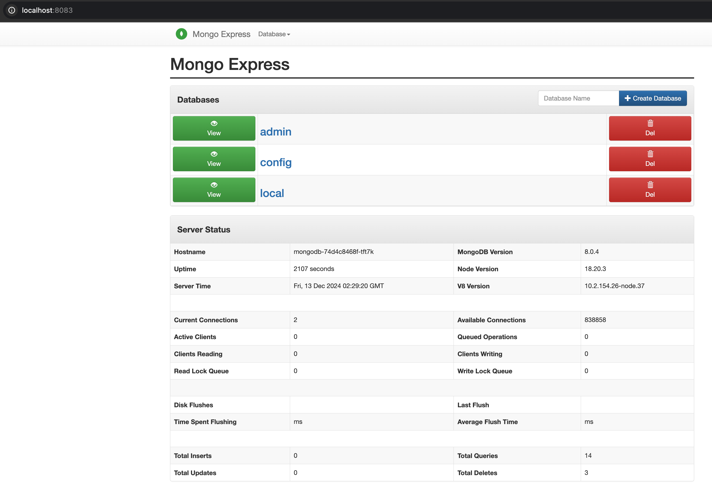

# Setup a Mongo on kind

- Asuming you still have this setup from the exercise before, otherwise just do the setup part

  

- Apply the YAML files using `kubectl` 

  ```bash
  ❯ kubectl apply -f mongodb-deployment.yaml
  
  persistentvolumeclaim/mongodb-pvc created
  deployment.apps/mongodb created
  service/mongodb created
  
  ❯ kubectl apply -f mongo-express-deployment.yaml
  
  deployment.apps/mongo-express created
  service/mongo-express created
  ```

- Verify that the pods are running

  ```bash
  ❯ kubectl get pods
  
  NAME                                      READY   STATUS    RESTARTS        AGE
  mongo-express-7c9b887d95-c8bdn            1/1     Running   0               2m33s
  mongodb-74d4c8468f-8w7f9                  1/1     Running   0               3m5s
  ```

- Check the services to retrieve their details

  ```bash
  ❯ kubectl get svc
  
  NAME                     TYPE        CLUSTER-IP      EXTERNAL-IP   PORT(S)          AGE
  kubernetes               ClusterIP   10.96.0.1       <none>        443/TCP          6d8h
  mongo-express            NodePort    10.96.200.91    <none>        8083:32198/TCP   4m20s
  mongodb                  ClusterIP   10.96.103.147   <none>        27017/TCP        4m55s
  
  ```

- Port forward mongo express

  ```bash
  ❯ kubectl port-forward service/mongo-express 8083:8083
  ```

- Note from here down was me thinking it was not working but it waws all working however it ws a fun journey trying to investigate, if you don't care the answer to login into express is at the bottom :), but for a good journey and a laugh try figure out one thought at a time

- Login to the system making sure of the username and password

  ```bash
  ❯ kubectl describe pod mongodb | grep -A5 "Environment:"
  
      Environment:
        MONGO_INITDB_ROOT_USERNAME:  rootuser
        MONGO_INITDB_ROOT_PASSWORD:  rootpass
      Mounts:
        /data/db from mongodb-data (rw)
        /var/run/secrets/kubernetes.io/serviceaccount from kube-api-access-977pk (ro)
  ```

- Any issues check the logs

  ```bash
  ❯ kubectl get svc mongodb
  
  NAME      TYPE        CLUSTER-IP      EXTERNAL-IP   PORT(S)     AGE
  mongodb   ClusterIP   10.96.103.147   <none>        27017/TCP   16m
  
  ❯ kubectl run test-pod --rm -it --image=busybox -- /bin/sh
  ❯ telnet mongodb 27017
  Connected to mongodb
  
  ```

- If the manual dialog is not working just do it as a command

  ```bash
  ❯ kubectl exec -it mongodb -- mongo -u rootuser -p rootpass --authenticationDatabase admin
  
  Error from server (NotFound): pods "mongodb" not found
  ```

- Check the pods

  ```bash
  ❯ kubectl get pods
  
  NAME                                      READY   STATUS    RESTARTS      AGE
  mongo-express-7c9b887d95-c8bdn            1/1     Running   0             23m
  mongodb-74d4c8468f-8w7f9                  1/1     Running   0             23m
  test-pod                                  1/1     Running   0             7m6s
  ```

- Check deployments

  ```bash
  ❯ kubectl get deployments
  
  NAME                     READY   UP-TO-DATE   AVAILABLE   AGE
  mongo-express            1/1     1            1           24m
  mongodb                  1/1     1            1           25m
  ```

- Describe deployment

  ```bash
  ❯ kubectl describe deployment mongodb
  
  Name:                   mongodb
  Namespace:              default
  CreationTimestamp:      Fri, 13 Dec 2024 01:19:53 +0000
  Labels:                 <none>
  Annotations:            deployment.kubernetes.io/revision: 1
  Selector:               app=mongodb
  Replicas:               1 desired | 1 updated | 1 total | 1 available | 0 unavailable
  StrategyType:           RollingUpdate
  MinReadySeconds:        0
  RollingUpdateStrategy:  25% max unavailable, 25% max surge
  Pod Template:
    Labels:  app=mongodb
    Containers:
     mongodb:
      Image:      mongo:latest
      Port:       27017/TCP
      Host Port:  0/TCP
      Environment:
        MONGO_INITDB_ROOT_USERNAME:  rootuser
        MONGO_INITDB_ROOT_PASSWORD:  rootpass
      Mounts:
        /data/db from mongodb-data (rw)
    Volumes:
     mongodb-data:
      Type:       PersistentVolumeClaim (a reference to a PersistentVolumeClaim in the same namespace)
      ClaimName:  mongodb-pvc
      ReadOnly:   false
  Conditions:
    Type           Status  Reason
    ----           ------  ------
    Available      True    MinimumReplicasAvailable
    Progressing    True    NewReplicaSetAvailable
  OldReplicaSets:  <none>
  NewReplicaSet:   mongodb-74d4c8468f (1/1 replicas created)
  Events:
    Type    Reason             Age   From                   Message
    ----    ------             ----  ----                   -------
    Normal  ScalingReplicaSet  27m   deployment-controller  Scaled up replica set mongodb-74d4c8468f to 1
  ```

- Check all namespaces

  ```bash
  ❯ kubectl get all -n default
  NAME                                          READY   STATUS    RESTARTS      AGE
  pod/mongo-express-7c9b887d95-c8bdn            1/1     Running   0             29m
  pod/mongodb-74d4c8468f-8w7f9                  1/1     Running   0             30m
  pod/test-pod                                  1/1     Running   0             13m
  
  NAME                             TYPE        CLUSTER-IP      EXTERNAL-IP   PORT(S)          AGE
  service/kubernetes               ClusterIP   10.96.0.1       <none>        443/TCP          6d9h
  service/mongo-express            NodePort    10.96.200.91    <none>        8083:32198/TCP   29m
  service/mongodb                  ClusterIP   10.96.103.147   <none>        27017/TCP        30m
  
  NAME                                     READY   UP-TO-DATE   AVAILABLE   AGE
  deployment.apps/mongo-express            1/1     1            1           29m
  deployment.apps/mongodb                  1/1     1            1           30m
  
  NAME                                                DESIRED   CURRENT   READY   AGE
  replicaset.apps/mongo-express-7c9b887d95            1         1         1       29m
  replicaset.apps/mongodb-74d4c8468f                  1         1         1       30m
  ```

- Finally delete and recreate if problematic

  ```bash
  ❯ kubectl delete -f mongodb-deployment.yaml
  ❯ kubectl apply -f mongodb-deployment.yaml
  ```

- Connect toMongo pod

  ```bash
  ❯ kubectl get pods
  
  NAME                                      READY   STATUS    RESTARTS      AGE
  mongo-express-7c9b887d95-c8bdn            1/1     Running   0             36m
  mongodb-74d4c8468f-tft7k                  1/1     Running   0             2m23s
  test-pod                                  1/1     Running   0             20m
  
  ❯ kubectl port-forward pod/mongodb-74d4c8468f-tft7k 27017:27017
  
  Forwarding from 127.0.0.1:27017 -> 27017
  Forwarding from [::1]:27017 -> 27017
  ```

- In the end there was no problem with mongodb so investigated express

  ```bash
  ❯ kubectl exec -it mongo-express-7c9b887d95-c8bdn -- printenv
  
  
  ATH=/usr/local/sbin:/usr/local/bin:/usr/sbin:/usr/bin:/sbin:/bin
  HOSTNAME=mongo-express-7c9b887d95-c8bdn
  NODE_VERSION=18.20.3
  YARN_VERSION=1.22.19
  ME_CONFIG_MONGODB_URL=mongodb://mongo:27017
  ME_CONFIG_MONGODB_ENABLE_ADMIN=true
  ME_CONFIG_SITE_SESSIONSECRET=secret
  ME_CONFIG_BASICAUTH=true
  VCAP_APP_HOST=0.0.0.0
  ME_CONFIG_OPTIONS_EDITORTHEME=midnight
  ME_CONFIG_MONGODB_ADMINUSERNAME=rootuser
  ME_CONFIG_MONGODB_ADMINPASSWORD=rootpass
  ME_CONFIG_MONGODB_SERVER=mongodb
  KUBERNETES_PORT_443_TCP_PORT=443
  MONGODB_SERVICE_HOST=10.96.103.147
  MONGODB_PORT_27017_TCP_PORT=27017
  MONGO_EXPRESS_SERVICE_HOST=10.96.200.91
  MONGO_EXPRESS_PORT_8083_TCP_PROTO=tcp
  KUBERNETES_SERVICE_PORT_HTTPS=443
  KUBERNETES_PORT=tcp://10.96.0.1:443
  MONGODB_PORT=tcp://10.96.103.147:27017
  KUBERNETES_PORT_443_TCP_ADDR=10.96.0.1
  MONGO_EXPRESS_PORT_8083_TCP=tcp://10.96.200.91:8083
  KUBERNETES_PORT_443_TCP=tcp://10.96.0.1:443
  KUBERNETES_PORT_443_TCP_PROTO=tcp
  HELLO_WORLD_HELLOWORLD_SERVICE_PORT=80
  MONGODB_PORT_27017_TCP=tcp://10.96.103.147:27017
  MONGODB_PORT_27017_TCP_ADDR=10.96.103.147
  KUBERNETES_SERVICE_HOST=10.96.0.1
  KUBERNETES_SERVICE_PORT=443
  HELLO_WORLD_HELLOWORLD_SERVICE_PORT_HTTP=80
  MONGODB_SERVICE_PORT=27017
  MONGODB_PORT_27017_TCP_PROTO=tcp
  MONGO_EXPRESS_PORT_8083_TCP_ADDR=10.96.200.91
  MONGO_EXPRESS_SERVICE_PORT=8083
  MONGO_EXPRESS_PORT=tcp://10.96.200.91:8083
  MONGO_EXPRESS_PORT_8083_TCP_PORT=8083
  TERM=xterm
  HOME=/root
  ```

- Finally checked the logs on Mongo Express 

  ```bash
  ❯ kubectl logs mongo-express-7c9b887d95-c8bdn
  
  Waiting for mongo:27017...
  /docker-entrypoint.sh: line 15: mongo: Name does not resolve
  /docker-entrypoint.sh: line 15: /dev/tcp/mongo/27017: Invalid argument
  Fri Dec 13 01:21:22 UTC 2024 retrying to connect to mongo:27017 (2/10)
  /docker-entrypoint.sh: line 15: mongo: Name does not resolve
  /docker-entrypoint.sh: line 15: /dev/tcp/mongo/27017: Invalid argument
  Fri Dec 13 01:21:23 UTC 2024 retrying to connect to mongo:27017 (3/10)
  /docker-entrypoint.sh: line 15: mongo: Name does not resolve
  /docker-entrypoint.sh: line 15: /dev/tcp/mongo/27017: Invalid argument
  Fri Dec 13 01:21:24 UTC 2024 retrying to connect to mongo:27017 (4/10)
  /docker-entrypoint.sh: line 15: mongo: Name does not resolve
  /docker-entrypoint.sh: line 15: /dev/tcp/mongo/27017: Invalid argument
  Fri Dec 13 01:21:25 UTC 2024 retrying to connect to mongo:27017 (5/10)
  /docker-entrypoint.sh: line 15: mongo: Name does not resolve
  /docker-entrypoint.sh: line 15: /dev/tcp/mongo/27017: Invalid argument
  Fri Dec 13 01:21:26 UTC 2024 retrying to connect to mongo:27017 (6/10)
  /docker-entrypoint.sh: line 15: mongo: Name does not resolve
  /docker-entrypoint.sh: line 15: /dev/tcp/mongo/27017: Invalid argument
  Fri Dec 13 01:21:27 UTC 2024 retrying to connect to mongo:27017 (7/10)
  /docker-entrypoint.sh: line 15: mongo: Name does not resolve
  /docker-entrypoint.sh: line 15: /dev/tcp/mongo/27017: Invalid argument
  Fri Dec 13 01:21:28 UTC 2024 retrying to connect to mongo:27017 (8/10)
  /docker-entrypoint.sh: line 15: mongo: Name does not resolve
  /docker-entrypoint.sh: line 15: /dev/tcp/mongo/27017: Invalid argument
  Fri Dec 13 01:21:29 UTC 2024 retrying to connect to mongo:27017 (9/10)
  /docker-entrypoint.sh: line 15: mongo: Name does not resolve
  /docker-entrypoint.sh: line 15: /dev/tcp/mongo/27017: Invalid argument
  Fri Dec 13 01:21:30 UTC 2024 retrying to connect to mongo:27017 (10/10)
  /docker-entrypoint.sh: line 15: mongo: Name does not resolve
  /docker-entrypoint.sh: line 15: /dev/tcp/mongo/27017: Invalid argument
  No custom config.js found, loading config.default.js
  Welcome to mongo-express 1.0.2
  ------------------------
  
  
  Mongo Express server listening at http://0.0.0.0:8081
  Server is open to allow connections from anyone (0.0.0.0)
  basicAuth credentials are "admin:pass", it is recommended you change this in your config.js!
  ```

- And in the end there was the answer to my problem - **admin:pass** is the credentials for express and I sure felt stupido :)

  