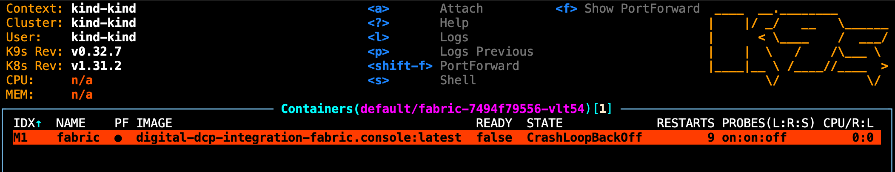
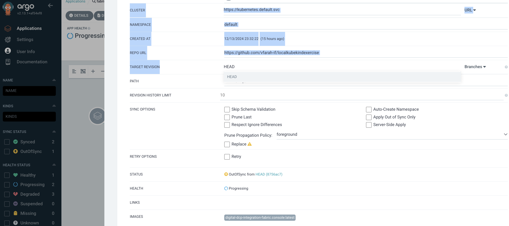
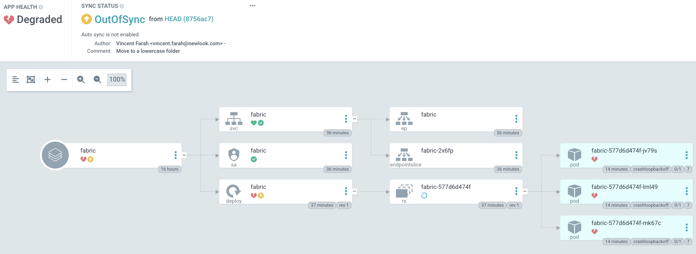
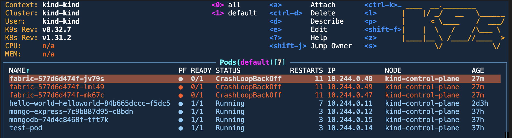
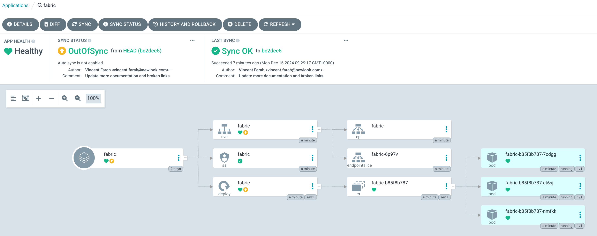

## Setup a mock digital commerce platform to learn scaling

- Create **fabric, inventory and search** using helm as placeholders to get this deployed to your local *Argo*. This will start with fabric, a name place holder for a real microservice that gets deployed to docker using docker compose locally, and you can do the same with the inventory and search microservice. For the purpose of brevity, fabric will only be discussed and you simply do the same with inventory and search.

```bash
❯ helm create fabric

Creating fabric

❯ helm create inventory

Creating inventory

❯ helm create search

Creating search
```

#### Use `kind` to Load the Local Docker Image

- Build an image using `docker-compose` or `docker build` 

  ```bash
  ❯ docker-compose build fabric.console
  or
  ❯ docker build -t digital-dcp-integration-fabric.console:latest .
  ```

- Load the image into your `kind` cluster and update any changes pushed to docker using this line

  ```bash
  ❯ kind load docker-image digital-dcp-integration-fabric.console:latest
  
  Image: "digital-dcp-integration-fabric.console:latest" with ID "sha256:c07801650fd5e965cd8b135bb91648697760c78decc19e1c7f887f9d632db600" not yet present on node "kind-control-plane", loading...
  ```

- Verify the image is now available in the `kind` cluster

  ```bash
  ❯ kubectl get pods -n kube-system
  
  NAME                                         READY   STATUS    RESTARTS       AGE
  coredns-7c65d6cfc9-c78fm                     1/1     Running   9 (19m ago)    7d
  coredns-7c65d6cfc9-k5c7f                     1/1     Running   9 (19m ago)    7d
  etcd-kind-control-plane                      1/1     Running   9 (19m ago)    7d
  kindnet-zv6j5                                1/1     Running   9 (19m ago)    7d
  kube-apiserver-kind-control-plane            1/1     Running   10 (19m ago)   7d
  kube-controller-manager-kind-control-plane   1/1     Running   14 (19m ago)   7d
  kube-proxy-29wzb                             1/1     Running   9 (19m ago)    7d
  kube-scheduler-kind-control-plane            1/1     Running   13 (19m ago)   7d
  
  ❯ kind load docker-image digital-dcp-integration-fabric.console:latest
  
  Image: "digital-dcp-integration-fabric.console:latest" with ID "sha256:c07801650fd5e965cd8b135bb91648697760c78decc19e1c7f887f9d632db600" found to be already present on all nodes.
  ```

#### Update the Helm Chart

- Your Helm chart needs to point to this local image. Edit `values.yaml` and ensure the image repository and tag match the local image name and tag:

  ```yaml
  image:
    repository: digital-dcp-integration-fabric.console
    tag: latest
    pullPolicy: IfNotPresent  # Avoid pulling from a registry
  ```

- Edit `templates/deployment.yaml` and ensure the `pullPolicy` is set correctly - in my generated example it seemed to be so no changes

  ```yaml
  containers:
  - name: fabric
    image: "{{ .Values.image.repository }}:{{ .Values.image.tag }}"
    imagePullPolicy: {{ .Values.image.pullPolicy }}
  ```

- In my case I had to expose `port 5001` to the outside tense, but this is not necessary for you

  ```yaml
apiVersion: v1
  kind: Service
  metadata:
    name: {{ include "fabric.fullname" . }}
    labels:
      {{- include "fabric.labels" . | nindent 4 }}
  spec:
    type: {{ .Values.service.type }}
    ports:
      - port: {{ .Values.service.port }}
        targetPort: 5001
  ```
  
  and I extended my live probe and readiness to be based on a micriservice health endpoint
  
  ```yaml
  livenessProbe:
  initialDelaySeconds: 60
    httpGet:
    path: /api/health
      port: 5001
  readinessProbe:
    initialDelaySeconds: 60
    httpGet:
      path: /api/health
      port: 5001

  ```

- Deploy can be done with helm charts or Argo

  - Deploy the helm chart

    ```bash
    ❯ helm install fabric ./fabric
    
    NAME: fabric
    LAST DEPLOYED: Fri Dec 13 17:06:05 2024
    NAMESPACE: default
    STATUS: deployed
    REVISION: 1
    NOTES:
    1. Get the application URL by running these commands:
      export POD_NAME=$(kubectl get pods --namespace default -l "app.kubernetes.io/name=fabric,app.kubernetes.io/instance=fabric" -o jsonpath="{.items[0].metadata.name}")
      export CONTAINER_PORT=$(kubectl get pod --namespace default $POD_NAME -o jsonpath="{.spec.containers[0].ports[0].containerPort}")
      echo "Visit http://127.0.0.1:8080 to use your application"
      kubectl --namespace default port-forward $POD_NAME 8080:$CONTAINER_PORT
    ~/Dev/localkubekindexercise/charts on main !13 ❯  
    ```

    - Verify the deployment

      ```bash
      ❯ kubectl get pods
      
      NAME                                      READY   STATUS    RESTARTS      AGE
      fabric-7494f79556-vlt54                   0/1     Running   4 (16s ago)   2m17s
      ```

    - I had an issue with my real work microservice as there was something making it fail, probably unable to connect to a database or something it needed in the real world.

      

  - **Scale up** the [replicasets](https://kubernetes.io/docs/concepts/workloads/controllers/replicaset/) from 1 o 3 within the `values.yaml` file

    ```yaml
    # https://kubernetes.io/docs/concepts/workloads/controllers/replicaset/
    replicaCount: 3
    ```

  - Deploy with Argo by configuring it with these settings and my sample repository 

    

    

    - Check loggings through replicasets or **rs** for aggregated logging or on a specific instance to see the logs under a specific pod instance

      

- What are **real world problems** I experienced to cause crashes that was not a problem in docker

  - Ensure that all **environment variables** required for the microservice are correctly passed to the pod `kubectl exec -it <pod-name> -- printenv` . My example had all of this built into the docker image built because I didn't want to expose secrets in environment variables.

    ```bash
    ❯ kubectl exec -it fabric-577d6d474f-jv79s -- printenv
    
    PATH=/usr/local/sbin:/usr/local/bin:/usr/sbin:/usr/bin:/sbin:/bin
    HOSTNAME=fabric-577d6d474f-jv79s
    APP_UID=1654
    ASPNETCORE_HTTP_PORTS=8080
    DOTNET_RUNNING_IN_CONTAINER=true
    DOTNET_SYSTEM_GLOBALIZATION_INVARIANT=true
    DOTNET_VERSION=8.0.6
    ASPNET_VERSION=8.0.6
    ...
    ```

  - Check networking for things like azure or databases. In my issue above I could see Azure Event Hubs was being disconnected for some reason, it requiring an outbound internet access. In a local Kubernetes setup (like `kind`), networking issues could arise.

    - **Verify DNS Resolution**: Ensure the pod can resolve e.g. Azure endpoints

      ```bash
      ❯ kubectl exec -it <pod-name> -- nslookup <your-eventhub-namespace>.servicebus.windows.net
      
      
      ❯ kubectl exec -it <pod-name> -- wget -v https://dcp-poc-uks-01.servicebus.windows.net
      
      --2024-12-14 15:56:40--  https://<your-eventhub-namespace>.servicebus.windows.net/
      Resolving dcp-poc-uks-01.servicebus.windows.net (dcp-poc-uks-01.servicebus.windows.net)... 20.90.128.129
      Connecting to dcp-poc-uks-01.servicebus.windows.net (dcp-poc-uks-01.servicebus.windows.net)|20.90.128.129|:443... connected.
      HTTP request sent, awaiting response... 200 OK
      ```

  - **Authentication issues**: 

    - Ensure the appropriate credentials are mounted or configured in the pod.

    - Test authentication from inside the pod:

      ```
      ❯ kubectl exec -it <pod-name> -- bash
      ❯ dotnet run -- test-eventhub-connection
      ```

  - Consider any potential differences between your **Docker and Kubernetes** environments

    - Docker might have direct internet access, while Kubernetes may be behind a network proxy

    - Kubernetes might enforce stricter resource limits. Check if your container is running out of memory or CPU:

      ```bash
      ❯ kubectl describe pod <pod-name>
      ```

  - Run a temporary pod with debugging tools to isolate the issue

    ```bash
    ❯ kubectl run debug-pod --image=mcr.microsoft.com/dotnet/runtime-deps:6.0 --restart=Never -- bash
    ```

  - My issue was related to exposing a health check endpoint to the outside, only understood when I tried to shell into it
  
    
  
  
